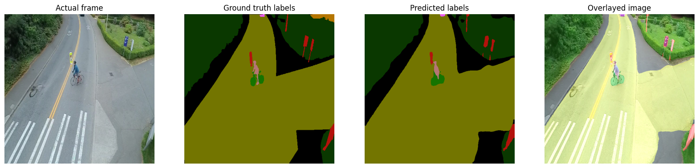
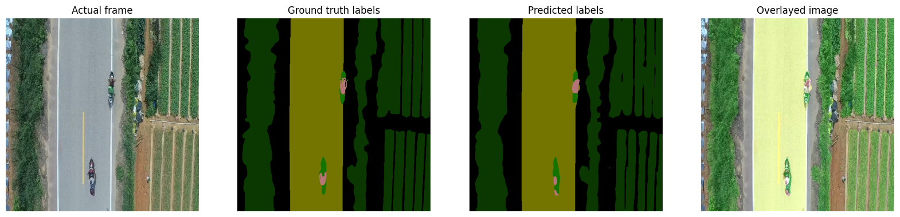
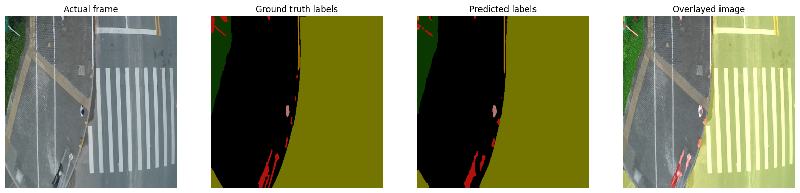
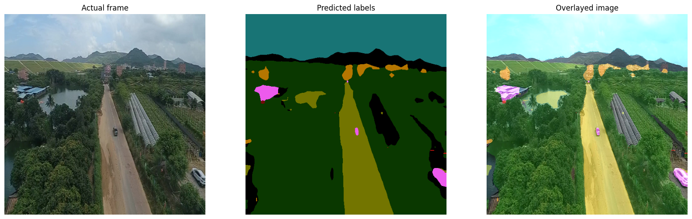
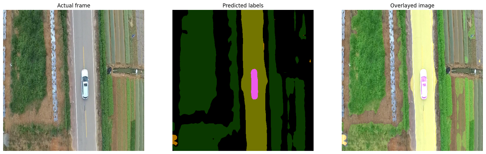
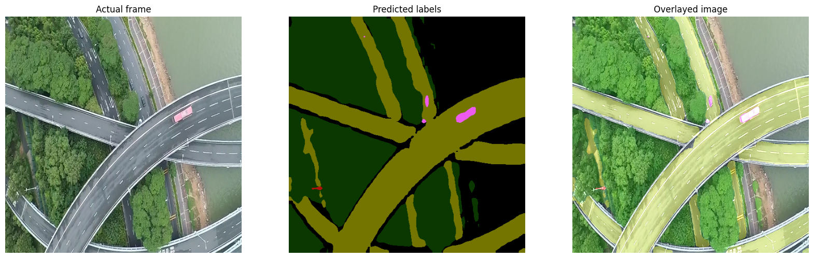

<div align="center">

# 🛰️ Aerial Drone Image Segmentation — DeepLabV3 + Dice/CE Loss

### 12-Class Aerial Scene Segmentation · PyTorch · Kaggle Competition

[](https://python.org)
[](https://pytorch.org)
[](https://pytorch.org/vision/stable/models/deeplabv3.html)
[](https://www.kaggle.com/competitions/open-cv-py-torch-segmentation-project-round-3/overview)
[](LICENSE)

</div>

---

> ## Results Preview
>
> <p align="center">
>   
> </p>
> <p align="center">
>   
> </p>
> <p align="center"><i>Original image · Ground-truth mask · Predicted mask · Predicted overlay</i></p>

---

## 📋 Table of Contents

1. [Overview](#-overview)
2. [Dataset](#-dataset)
3. [Architecture](#-architecture)
4. [Loss Function: Dice + Cross-Entropy](#-loss-function-dice--cross-entropy)
5. [Evaluation Metrics](#-evaluation-metrics)
6. [Training Configuration](#-training-configuration)
7. [Repository Structure](#-repository-structure)
8. [Installation](#-installation)
9. [Dataset Preparation](#-dataset-preparation)
10. [Training](#-training)
11. [Results](#-results)
12. [Inference & Submission](#-inference--submission)
13. [Limitations & Future Work](#-limitations--future-work)

---

## 🎯 Overview

This project trains a **semantic segmentation model** to label every pixel of a
drone (UAV) aerial photo into one of **12 scene classes** — background, person,
bike, car, drone, boat, animal, obstacle, construction, vegetation, road, and sky.

It was built for the Kaggle competition
**[OpenCV PyTorch Segmentation Project — Round 3](https://www.kaggle.com/competitions/open-cv-py-torch-segmentation-project-round-3/overview)**
("Drone Image Segmentation Project on 12 classes"), and currently scores
**0.57 on the public leaderboard** (Dice-based pixel-agreement metric).

The model is **DeepLabV3 with a ResNet-101 backbone**, fine-tuned from
ImageNet/COCO-pretrained weights, trained with a **combined Dice + Cross-Entropy
loss** plus an auxiliary classifier head — a setup designed to handle the heavy
class imbalance typical of aerial scenes (huge vegetation/road/sky regions vs.
tiny people, bikes, and animals).

### The 12 Classes

| ID | Class | ID | Class | ID | Class |
|---|---|---|---|---|---|
| 0 | Background | 4 | Drone | 8 | Construction |
| 1 | Person | 5 | Boat | 9 | Vegetation |
| 2 | Bike | 6 | Animal | 10 | Road |
| 3 | Car | 7 | Obstacle | 11 | Sky |

---

## 📦 Dataset

The dataset consists of high-resolution **drone/UAV aerial images** paired with
pixel-level semantic segmentation masks (12 classes, colour-coded per the table
above). It is provided via the Kaggle competition as:

```
train.csv            # ImageID column for training images (with masks)
test.csv             # ImageID column for test images (no masks — for submission)
imgs/imgs/*.jpg       # RGB images
masks/masks/*.png     # Colour-coded segmentation masks
sampleSubmission.csv # Submission format reference
```

Each mask pixel is one of the 12 RGB colours defined in `src/config.py`
(`ID2COLOR`), which the dataset loader converts to single-channel class-ID
masks via grayscale `cv2.IMREAD_GRAYSCALE` loading (the provided masks are
already stored as single-channel class-ID PNGs).

**Train/validation split:** 80% / 20% (`train_test_split`, seed=41), giving the
model a held-out validation set for model selection and the per-class IoU
breakdown shown in [Results](#-results).

---

## 🏗️ Architecture

```
Input (3, 512, 512)
        │
        ▼
┌──────────────────────────────┐
│   ResNet-101 Backbone          │   ImageNet-pretrained
│   (dilated convolutions,       │
│    output_stride=8)            │
└──────────────────────────────┘
        │
        ├──────────────────────────────┐
        ▼                              ▼
┌──────────────────────┐     ┌──────────────────────────┐
│  ASPP + Classifier     │     │  Auxiliary Classifier     │
│  Head (main output)    │     │  Head (training only)     │
│  -> 12 channels         │     │  -> 12 channels            │
└──────────────────────┘     └──────────────────────────┘
        │                              │
        ▼                              ▼
   Main logits                   Auxiliary logits
   (used for loss +              (auxiliary CE loss,
    predictions)                  weight = 0.5)
```

Both the main classifier and the auxiliary classifier's final `Conv2d` layers
are replaced with `nn.LazyConv2d(out_channels=12, kernel_size=1)` so the
pretrained backbone's learned features can be reused while the output head is
adapted to this task's 12 classes.

The auxiliary head (standard in DeepLabV3) is trained with its own
cross-entropy loss, added to the main loss with weight `0.5` — this provides
an additional gradient signal from an earlier layer in the network, which
tends to stabilise training for deep segmentation backbones.

---

## 🧮 Loss Function: Dice + Cross-Entropy

The training loss (`src/losses.py::dice_coef_loss`) combines two
complementary objectives:

```python
loss = (1.0 - mean_dice_foreground) + cross_entropy
```

**Why Dice?** Dice directly measures region overlap and is far less sensitive
to class imbalance than pixel-wise cross-entropy alone — important here
because `sky`, `vegetation`, and `road` can cover 80%+ of a frame while
`person`, `bike`, and `animal` may occupy only a handful of pixels.

**Why exclude the background class from Dice?** The Dice term is computed
per-class on one-hot softmax probabilities vs. one-hot ground truth, but
**class 0 (background) is dropped before averaging**:

```python
dice = dice[:, 1:]   # drop background class (index 0)
dice_mean = dice.mean()
```

Background pixels are extremely easy to get right (the model converges on
them almost immediately), so including them in the Dice average would mask
poor performance on the genuinely hard foreground classes. Dropping the
background class keeps the loss focused on the classes that actually
determine segmentation quality.

**Why add Cross-Entropy back in?** Dice alone can produce unstable gradients
early in training (especially with `smooth=1e-8`, a very small smoothing
constant). Cross-entropy provides a stable, well-behaved gradient signal from
the start, while Dice pushes the model toward better region-level overlap as
training progresses.

**Auxiliary loss:** DeepLabV3's auxiliary classifier output is trained with
plain cross-entropy (no Dice term) and added to the total loss with weight
`0.5`:

```python
total_loss = dice_coef_loss(main_out, target) + 0.5 * cross_entropy(aux_out, target)
```

---

## 📐 Evaluation Metrics

Three complementary metrics are tracked during training (`src/metrics.py`):

| Metric | Function | Used for |
|---|---|---|
| **Mean IoU** | `mean_iou()` | Per-image IoU averaged over classes present, then over the batch — standard segmentation quality measure |
| **Per-class IoU** | `iou_per_class()` | Tracks each of the 12 classes' IoU separately every validation epoch — used to spot which classes need attention |
| **Dice Coefficient (training-time)** | `dice_coef()` | Multi-class Dice including background, tracked alongside IoU during training |
| **Kaggle Dice (leaderboard)** | `kaggle_dice_per_image()` | The exact metric the competition leaderboard uses — computed **per image** as `2 * (#agreeing pixels) / (pred_size + true_size)`, then averaged across the validation set |

The `kaggle_dice_per_image` function is what the **best-checkpoint selection**
during training is based on (`valid_dice` in the training loop) — ensuring the
saved checkpoint is the one that would score best on the actual leaderboard
metric, not just the training loss.

---

## ⚙️ Training Configuration

| Parameter | Value |
|---|---|
| Model | DeepLabV3-ResNet101 (`torchvision`, ImageNet/COCO-pretrained) |
| Input resolution | 512 × 512 |
| Batch size | 32 |
| Epochs | 80 |
| Optimizer | Adam (`lr=4e-4`, `amsgrad=True`, fused) |
| Mixed precision | ✅ `torch.cuda.amp` (autocast + GradScaler) |
| Auxiliary loss weight | 0.5 |
| Train/val split | 80% / 20% (seed=41) |

### Data Augmentation (training set only)

Applied via `albumentations`, in order:

| Augmentation | Probability | Purpose |
|---|---|---|
| `HorizontalFlip` | 0.5 | Orientation invariance |
| `VerticalFlip` | 0.3 | Aerial views have no fixed "up" |
| `RandomRotate90` | 0.5 | Drone footage can be captured at any rotation |
| `RandomResizedCrop(512×512, scale=0.8–1.0)` | 0.5 | Scale invariance for objects at varying altitudes |
| `RandomBrightnessContrast` | 0.5 | Robustness to lighting conditions |

All images (train, validation, and test) are normalised using ImageNet
statistics (`mean=[0.485, 0.456, 0.406]`, `std=[0.229, 0.224, 0.225]`) to match
the pretrained backbone's expected input distribution.

---

## 📁 Repository Structure

```
drone-segmentation/
│
├── README.md
├── requirements.txt
├── .gitignore
│
├── src/
│   ├── config.py            # Dataclasses: dataset/training/model/inference configs + class-color map
│   ├── dataset.py            # CustomSegDataset + DataLoader factory
│   ├── model.py               # DeepLabV3 model builder (re-heads classifier for 12 classes)
│   ├── losses.py               # Dice + Cross-Entropy combo loss
│   ├── metrics.py               # Mean IoU, per-class IoU, Dice coefficient (training + leaderboard variants)
│   └── visualization.py          # Mask <-> RGB conversion, overlay rendering, denormalisation
│
├── scripts/
│   ├── train.py                  # Training loop (train_one_epoch, validate, main)
│   ├── visualize_predictions.py  # Generates original/GT/prediction/overlay comparison images
│   └── make_submission.py        # Runs inference on test set, writes RLE-encoded submission CSV
│
└── assets/
    └── predictions/              # Generated comparison images for this README
```

---

## ⚙️ Installation

### Prerequisites

- Python ≥ 3.10
- NVIDIA GPU with CUDA (training uses mixed precision; CPU training will be
  very slow at this resolution/batch size)

### Setup

```bash
git clone https://github.com/<your-username>/drone-segmentation.git
cd drone-segmentation

python -m venv .venv
source .venv/bin/activate        # Linux / macOS
# .venv\Scripts\activate         # Windows

pip install -r requirements.txt
```

---

## 📥 Dataset Preparation

1. Download the dataset from the
   [Kaggle competition page](https://www.kaggle.com/competitions/open-cv-py-torch-segmentation-project-round-3/data).
2. Extract it so the directory layout matches:

```
data/
├── train.csv
├── test.csv
├── sampleSubmission.csv
├── imgs/imgs/*.jpg
└── masks/masks/*.png
```

3. (Optional) Override paths via CLI flags if your layout differs — every
   script accepts `--image_dir`, `--mask_dir`, `--train_csv`, and `--test_csv`.

---

## 🏋️ Training

```bash
python -m scripts.train \
    --image_dir data/imgs/imgs \
    --mask_dir data/masks/masks \
    --train_csv data/train.csv \
    --test_csv data/test.csv \
    --epochs 80 \
    --batch_size 32 \
    --lr 4e-4
```

The best checkpoint (highest validation Dice, using the Kaggle-equivalent
metric) is saved to:

```
model_checkpoint/DeepLabv3_CamVid_Dice_loss/version_<N>/ckpt.tar
```

Each run creates a new `version_<N>` directory, so previous checkpoints are
never overwritten. The checkpoint contains the model weights, optimizer state,
AMP scaler state, the epoch number, the validation Dice score, and the
per-class IoU at that epoch.

---

## 📊 Results

**Leaderboard score: 0.57** (Kaggle Dice metric on the held-out test set)

### Training Setup Recap

- 80 epochs, DeepLabV3-ResNet101, Dice+CE loss with auxiliary head
- Validation Dice (`kaggle_dice_per_image`, averaged) tracked every epoch;
  best checkpoint selected on this metric

### Qualitative Results


<p align="center">
  
</p>
<p align="center">
  
</p>
<p align="center">
  
</p>

<p align="center"><i>Left to right: original image, ground-truth mask, predicted mask, predicted overlay</i></p>

### Test Set Predictions (no ground truth available)

<p align="center">
  
</p>
<p align="center">
  
</p>
<p align="center">
  
</p>

<p align="center"><i>Left to right: original image, predicted mask, predicted overlay</i></p>

### Generating the README Images

```bash
python -m scripts.visualize_predictions \
    --checkpoint model_checkpoint/DeepLabv3_CamVid_Dice_loss/version_0/ckpt.tar \
    --split both \
    --num_batches 2 \
    --output_dir assets/predictions
```

This saves `valid_sample_*.png` (4-panel: image / GT / prediction / overlay)
and `test_sample_*.png` (3-panel: image / prediction / overlay) to
`assets/predictions/`, ready to embed directly in this README.

### Interpreting the 0.57 Score

A Dice score of 0.57 on this metric reflects **overall pixel-agreement across
all 12 classes on the full-resolution test images** (predictions are resized
back to the original image resolution before scoring). Given the dataset's
class imbalance — large, easy classes (sky, vegetation, road) dominate pixel
counts, while small/rare classes (person, bike, animal, drone) are
disproportionately hard — this score reflects a model that segments dominant
scene regions well but still has room to improve on small or rare foreground
objects. See [Limitations & Future Work](#-limitations--future-work) for
concrete next steps to push this further.

---

## 🔍 Inference & Submission

Generate a Kaggle-format submission CSV (RLE-encoded, one row per image-class
pair) from a trained checkpoint:

```bash
python -m scripts.make_submission \
    --checkpoint model_checkpoint/DeepLabv3_CamVid_Dice_loss/version_0/ckpt.tar \
    --output submission.csv
```

This:
1. Runs the model over every test image
2. Resizes each prediction back to the **original image resolution** (the
   model operates at 512×512, but the competition scores at native resolution)
3. For each of the 12 classes, RLE-encodes the binary mask (or `NaN` if the
   class is absent from that image)
4. Writes `submission.csv` in the format expected by
   `sampleSubmission.csv`

---

## 🔮 Limitations & Future Work

- [ ] **Class-weighted loss** — explicitly upweight rare classes (person,
      bike, animal, drone, boat) in the cross-entropy term to push per-class
      IoU up for underrepresented categories
- [ ] **Higher input resolution** — small objects (people, bikes) lose detail
      at 512×512; testing 768×768 or tiled inference could help
- [ ] **Stronger backbone / architecture** — compare against
      `deeplabv3_resnet50` (faster) vs. a transformer-based segmentation head
      (e.g. SegFormer) for a direct accuracy/speed trade-off study
- [ ] **Test-time augmentation (TTA)** — horizontal/vertical flip + rotate
      averaging at inference time, which pairs naturally with the
      flip/rotate augmentations already used in training
- [ ] **Post-processing** — morphological cleanup or CRF-based refinement of
      predicted masks, particularly for small/fragmented foreground regions
- [ ] **Per-class threshold tuning** — for rare classes, tune the decision
      boundary rather than relying purely on `argmax` over softmax outputs
- [ ] **Ensemble** — average predictions across multiple checkpoints / seeds
      for a final leaderboard push

---

## 📄 License

This project is released under the [MIT License](LICENSE).

The dataset is provided via the
[Kaggle competition](https://www.kaggle.com/competitions/open-cv-py-torch-segmentation-project-round-3/overview)
and is subject to Kaggle's competition rules and terms of use.

---

<div align="center">

**Built for the OpenCV PyTorch Segmentation Project — Round 3 (Kaggle)**

[Kaggle Profile →](https://www.kaggle.com/vishwanath523)

</div>
